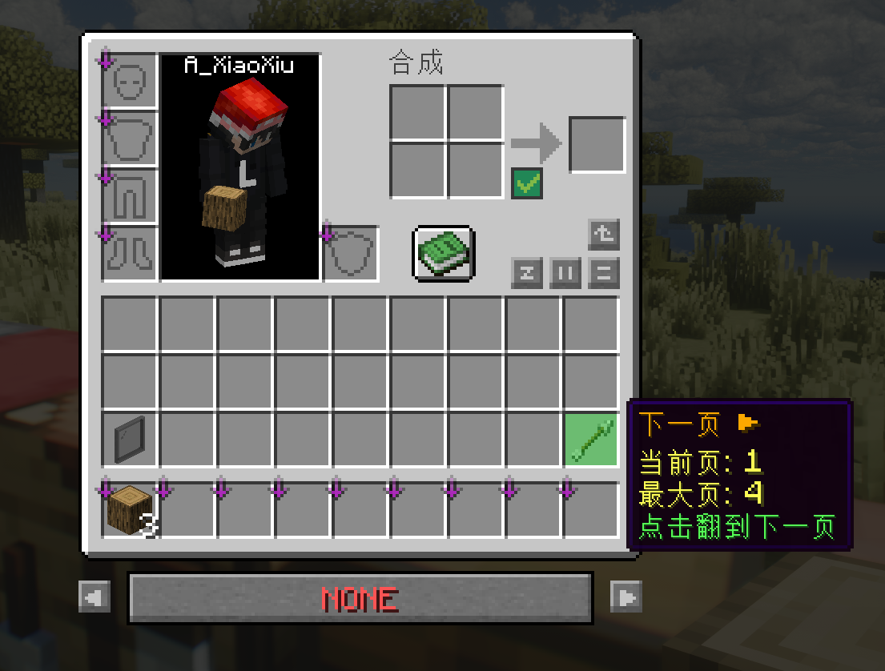
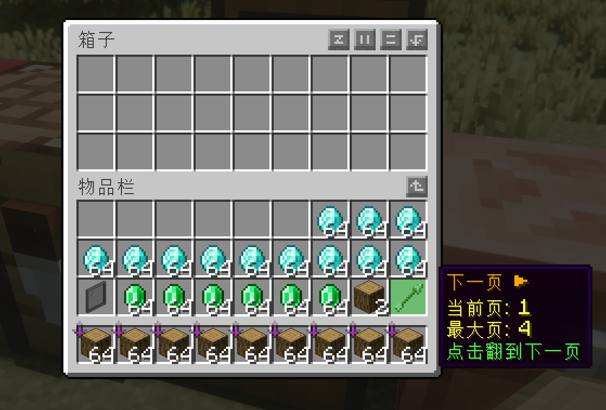
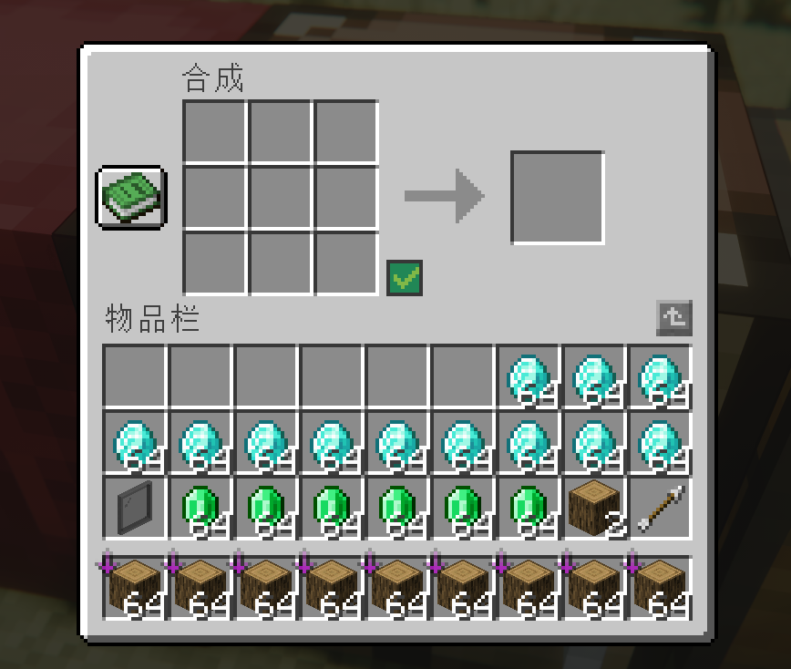
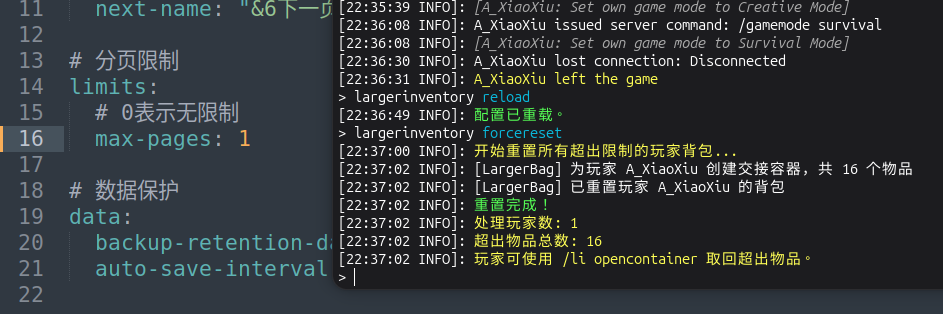
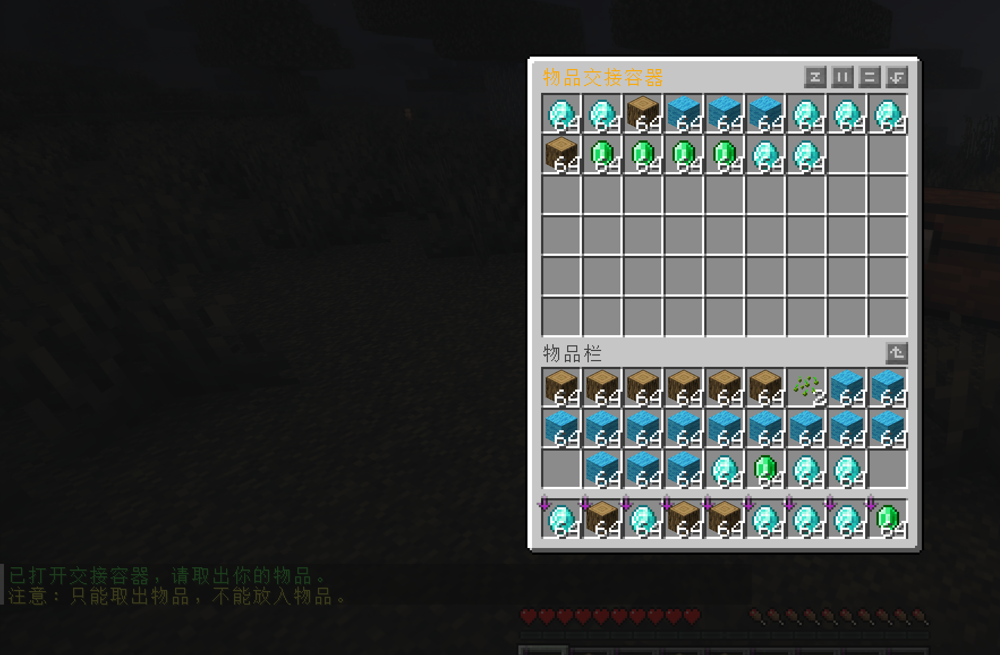

# LargerInventory


[中文](#中文) | [English](#english)

---
<a name="中文"></a>
## 中文

一个 Minecraft Spigot 插件，通过分页系统扩展玩家背包容量。

### 功能特性

- **分页背包** - 将玩家背包扩展为最多 99 页，远超原版 27 格限制
- **翻页按钮** - 直观的上一页/下一页按钮，支持自定义位置和外观
- **自动保存** - 定时将数据持久化到 SQLite 数据库
- **交接容器** - 页数满时物品自动转入交接容器，防止丢失
- **懒加载** - 仅加载当前页数据，减少内存占用
- **LRU 缓存** - 内存中仅保留最近访问的 6 页，优化性能
- **国际化支持** - 支持中文和英文，可在配置中切换

### 环境要求

- Java 21+
- Spigot/Paper 1.21+

### 安装

1. 从 [Releases](https://gitee.com/sh-xiaoxiu/spigot-larger-inventory/releases) 下载最新版本的 JAR 文件
2. 放入服务器的 `plugins` 目录
3. 重启服务器或使用插件管理器加载

### 配置

配置文件位于 `plugins/LargerInventory/config.yml`：

```yaml
# 语言设置 (zh_CN / en_US)
language: zh_CN

# 按钮设置
buttons:
  prev-page-slot: 27    # 上一页按钮槽位 (9-35)
  next-page-slot: 35    # 下一页按钮槽位 (9-35)
  prev-material: "ARROW"
  next-material: "ARROW"
  prev-name: "&6◀ 上一页"
  next-name: "&6下一页 ▶"

# 分页限制 (0 = 使用最大限制 99 页)
limits:
  max-pages: 0

# 数据保护
data:
  backup-retention-days: 7
  auto-save-interval-seconds: 300
```

### 命令

| 命令 | 说明 | 权限 |
|------|------|------|
| `/li info [player]` | 查看玩家背包信息 | `largerinventory.admin` |
| `/li forcereset` | 强制重置超出限制的背包 | `largerinventory.admin` |
| `/li opencontainer [player]` | 打开交接容器 | `largerinventory.admin` |
| `/li bypass` | 创造模式下临时解除按钮槽拦截 | `largerinventory.admin.bypass` |
| `/li reload` | 重载配置文件 | `largerinventory.admin` |

#### Bypass 模式

创造模式下使用 `/li bypass` 可临时解除按钮槽拦截，允许管理员自由编辑背包中的按钮槽位。

- **开启条件**：必须处于创造模式
- **使用方式**：输入 `/li bypass` 开启，再次输入关闭
- **关闭要求**：关闭前需先清空按钮槽中的物品
- **自动退出**：切换出创造模式时自动关闭 bypass 模式

### 权限

| 权限节点 | 说明 | 默认 |
|----------|------|------|
| `largerinventory.use` | 使用扩展背包功能 | 玩家 |
| `largerinventory.player.opencontainer` | 打开自己的交接容器 | 玩家 |
| `largerinventory.player.info` | 查看自己的背包信息 | 玩家 |
| `largerinventory.admin.forcereset` | 强制重置背包 | OP |
| `largerinventory.admin.opencontainer` | 打开任意玩家交接容器 | OP |
| `largerinventory.admin.reload` | 重载配置 | OP |
| `largerinventory.admin.info` | 查看任意玩家背包信息 | OP |
| `largerinventory.admin.bypass` | 创造模式下解除按钮槽拦截 | OP |
| `largerinventory.admin.*` | 所有管理员权限 | OP |

### 数据存储

数据保存在 `plugins/LargerInventory/data.db` (SQLite 数据库)。

### 构建

```bash
./gradlew build
```

构建产物位于 `build/libs/` 目录。

---

<a name="english"></a>
## English

A Minecraft Spigot plugin that extends player inventory capacity through a paging system.

### Features

- **Paged Inventory** - Expand player inventory up to 99 pages, far beyond the vanilla 27-slot limit
- **Page Navigation Buttons** - Intuitive previous/next page buttons with customizable position and appearance
- **Auto-save** - Periodically persist data to SQLite database
- **Handover Container** - Items automatically transfer to handover container when pages are full, preventing item loss
- **Lazy Loading** - Only load current page data to reduce memory usage
- **LRU Cache** - Keep only the 6 most recently accessed pages in memory for optimized performance
- **i18n Support** - Supports Chinese and English, switchable via configuration

### Requirements

- Java 21+
- Spigot/Paper 1.21+

### Installation

1. Download the latest JAR file from [Releases](https://gitee.com/sh-xiaoxiu/spigot-larger-inventory/releases)
2. Place it in the server's `plugins` directory
3. Restart the server or use a plugin manager to load it

### Configuration

Configuration file located at `plugins/LargerInventory/config.yml`:

```yaml
# Language settings (zh_CN / en_US)
language: en_US

# Button settings
buttons:
  prev-page-slot: 27    # Previous page button slot (9-35)
  next-page-slot: 35    # Next page button slot (9-35)
  prev-material: "ARROW"
  next-material: "ARROW"
  prev-name: "&6◀ Previous"
  next-name: "&6Next ▶"

# Page limits (0 = use maximum limit of 99 pages)
limits:
  max-pages: 0

# Data protection
data:
  backup-retention-days: 7
  auto-save-interval-seconds: 300
```

### Commands

| Command | Description | Permission |
|---------|-------------|------------|
| `/li info [player]` | View player inventory info | `largerinventory.admin` |
| `/li forcereset` | Force reset inventory exceeding limits | `largerinventory.admin` |
| `/li opencontainer [player]` | Open handover container | `largerinventory.admin` |
| `/li bypass` | Temporarily bypass button slot protection in creative mode | `largerinventory.admin.bypass` |
| `/li reload` | Reload configuration | `largerinventory.admin` |

#### Bypass Mode

Use `/li bypass` in creative mode to temporarily bypass button slot protection, allowing admins to freely edit button slots in inventory.

- **Activation**: Must be in creative mode
- **Usage**: Type `/li bypass` to enable, type again to disable
- **Disable Requirement**: Clear items from button slots before disabling
- **Auto-exit**: Automatically disables when switching out of creative mode

### Permissions

| Permission Node | Description | Default |
|-----------------|-------------|---------|
| `largerinventory.use` | Use extended inventory feature | Player |
| `largerinventory.player.opencontainer` | Open own handover container | Player |
| `largerinventory.player.info` | View own inventory info | Player |
| `largerinventory.admin.forcereset` | Force reset inventory | OP |
| `largerinventory.admin.opencontainer` | Open any player's handover container | OP |
| `largerinventory.admin.reload` | Reload configuration | OP |
| `largerinventory.admin.info` | View any player's inventory info | OP |
| `largerinventory.admin.bypass` | Bypass button slot protection in creative | OP |
| `largerinventory.admin.*` | All admin permissions | OP |

### Data Storage

Data is saved in `plugins/LargerInventory/data.db` (SQLite database).

### Building

```bash
./gradlew build
```

The build artifact will be located in the `build/libs/` directory.

---

## Screenshots / 游戏截图

### Paged Inventory / 分页背包





### Page Transition / 翻页演示


### Handover Container / 交接容器




---

## Author / 作者

XiaoXiu - [www.xiuxius.cn](https://www.xiuxius.cn)

## License / 许可证

MIT License
